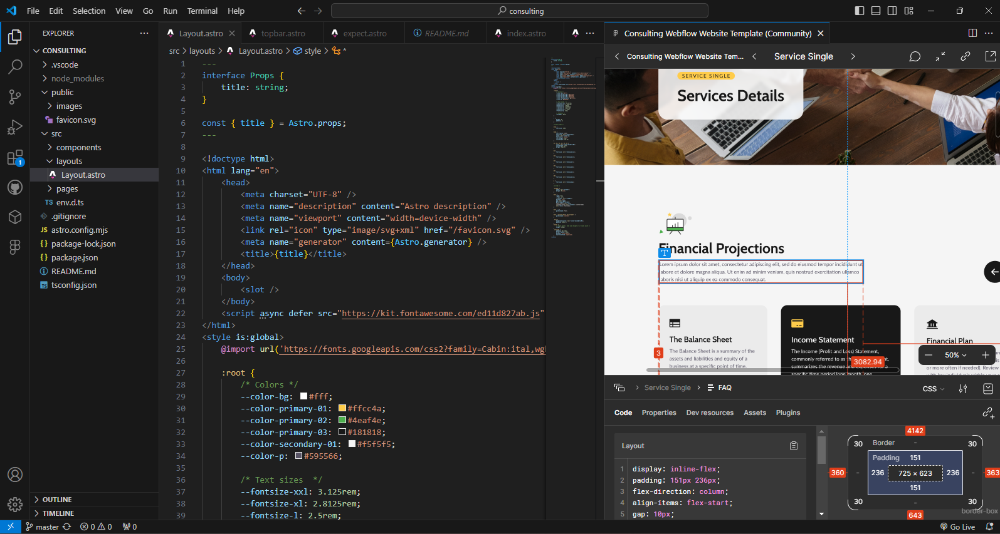
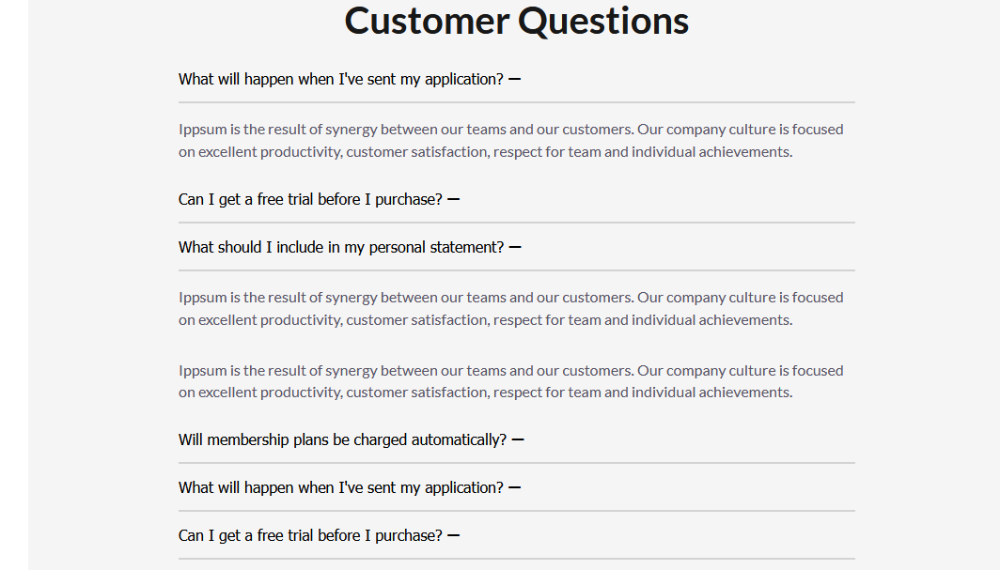

# "Ask Experts" - Figma mockup til astro webside integrering!

Formål med denne opgave var integrering af en Figma mockup til en webside lavet i Astro. Siden skal deployes hos Netlify
Der er 4 sider:

- About https://calm-peony-84fa0f.netlify.app/
- Team https://calm-peony-84fa0f.netlify.app/teampage/
- Case Study Single https://calm-peony-84fa0f.netlify.app/casestudypage/
- Service Single https://calm-peony-84fa0f.netlify.app/servicepage/

*Integrering inkluderer ikke en header(menu) eller footer, som vi blev bedt om at se bort fra, iflg opgavebeskrivelsen.*

For at kunne løse den, har jeg installeret en figma plugin til vscode, så jeg kan vise selve mockup, downloade assets, se design guide og meget mere:

### Layout og style
Min hoved (og eneste) Layout indeholder den overordnet layout beskrivelse (grid med navngivne lines), samt sætter nogle css værdier for farver og fonter for yderlige brug.
Layout indeholder to typer af navngivne lines: Full, Wrapper. Websiden følger denne grid lodret.
Alle afsnit er fordelt i sections som ligger i separate components, som har noget specifik styling som er unik til pågældende component. Grundet er at næsten alle afsnit på siden er ret forskellige, og der mangler konsistens gennem selve figma mockup-en, jeg har forsøgt at integrere design så tæt på figma filen som muligt. 
Hver side består af flere components, og følger layout som er sat op i Layout.astro

### Components med properties
Nogle components bruger astro props til at kunne lave nogle gentagende elementer hurtigt og nemt(som f.eks. cards).
F.eks. en component til at lave en team-medlem card skal bruge et navn, kort beskrivelse, billede-navn og stilling. Bagefter kan jeg genbruge component til at lave flere team-medlemmer

### Ikoner
Jeg har både downloaded ikoner som assets fra figma mockup, og brugt font-awesome.
I tilfælde af slider på service single siden, for at skifte farver på svg, når der er hover over boksen har jeg brugt "use" inde i inlinede svg, hvor jeg kan sende en filnavn som componenten kræver. På den måde kan jeg få fat i <path> delen af svg'en og fortælle den hvilken farve den skal bruge. Jeg har også skiftet fill="currentColor" på alle 4 svger, så farven kan skiftes med css "color".

### Slider
Slider på service single siden bruger en simpelt javascript som tilføjer nogle event listeners til kontrol-knapper (frem, tilbage). Event listeners ændrer margin af boksen som indeholder 4 cards.
Ulempen her er at denne slider vil kun virke med 4 elementer.

### Accordion
Accordion på service single siden er lavet ved hjælp af data-view html attribut. Denne data-view bestemmer hvilken tab skal vises, når en knap bliver klikket, og er afhæning af tab id.
Javascripten udregner hvor stor boksen skal være, for at kunne animere height værdien.

## Konklusion
I denne opgave har jeg brugt flere nye teknikker som blev introduceret i "Design for Developers": benyttet grid og flex til at definere layout, brugt container queries istedet for media queries, har brugt komplekse og præcise css selectorer som :has og psueduselectors som before og after, anvendt nesting i css, har prøvet at manipulere med svg og meget mere. Der var flere udfordringer, og nogne af dem blev ikke løst (grafikken i nogle af bokser) men i det hele så synes jeg at jeg har nået det meste af det

